Project 0 Getting Started
====================

**University of Pennsylvania, CIS 5650: GPU Programming and Architecture, Project 0**

* Chen Cheng
  * [GitHub](https://github.com/ischencheng)
  * [LinkedIn](https://www.linkedin.com/in/chen-andrew-cheng-34a133229/)
* Late days used for this project: **0**.
* Tested on: Windows 11 Home (build 26200), Intel Core i5-12500H, 16 GB RAM,
  NVIDIA GeForce RTX 2050 with 4 GB VRAM (personal HONOR GLO-FX6P laptop).
* GPU Compute Capability: **8.6** (`sm_86`), reported by the running application.

## Development Environment

| Component | Version |
| --- | --- |
| Visual Studio | Community 2022, 17.14.13 |
| MSVC toolset | v143, 14.44.35207 |
| Windows SDK selected by CMake | 10.0.26100.0 |
| CUDA Toolkit | 13.0.48 |
| NVIDIA Studio Driver | 580.97 |
| CMake | 3.30.0-rc3 |
| Nsight Compute | 2025.3.0 |
| Nsight Systems | 2025.5.1 |
| Nsight Graphics | 2025.4.1 |
| Nsight Visual Studio Edition | 2025.3 |

The existing CMake and driver versions were retained. The CUDA GL Check was
successfully built and run with this configuration. GPU performance counter
access is enabled for all users; Nsight Systems results are recorded below.

## CUDA GL Check

Built and ran the Debug x64 configuration. The window title displays my name,
the GPU model, and Compute Capability 8.6.


The CUDA kernel writes pixel colors into an OpenGL Pixel Buffer Object (PBO),
which OpenGL uses to update and display a texture. The two colors encode the
GPU's Compute Capability:

* The upper half is blue (`#0080ff`), representing the major version **8**.
* The lower half is spring green (`#00ff80`), representing the minor version **6**.

This result verifies that CUDA computation and CUDA/OpenGL interoperability
work on the tested machine. Compute Capability describes GPU architecture
features; it is distinct from the CUDA Toolkit and display driver versions.

### Build and Run

From the repository root in PowerShell:

```powershell
cmake -S cuda-gl-check -B cuda-gl-check/build/2026 -G "Visual Studio 17 2022" -A x64 -T cuda=13.0
cmake --build cuda-gl-check/build/2026 --config Debug --parallel 4
& .\cuda-gl-check\build\2026\bin\Debug\cuda-gl-check.exe
```

The `build/2026` directory keeps the current generated solution separate from
an older local build cache. Neither CUDA GL Check CMakeLists.txt was modified.

## Nsight CUDA Debugging

Used Nsight Visual Studio Edition to pause the Debug build at `kernel.cu`
line 79 inside `createVersionVisualization`. Switching to the next active
warp changed the selected thread from `(0,0,0)` to `(0,2,0)` within block
`(0,0,0)`, changing the pixel index from 0 to 1600.

The conditional breakpoint `index == 1234` selected block `(27,0,0)` and
thread `(2,1,0)`. With a block size of `(16,16,1)` and image width 800:

```text
x = 27 * 16 + 2 = 434
y = 0 * 16 + 1 = 1
index = 434 + 1 * 800 = 1234
```

In Warp Info, CTA identifies the thread block. Selecting lane 18 (the 19th
thread cell) in this block's first warp restored focus to thread `(2,1,0)`;
the Autos values and yellow thread marker agree.

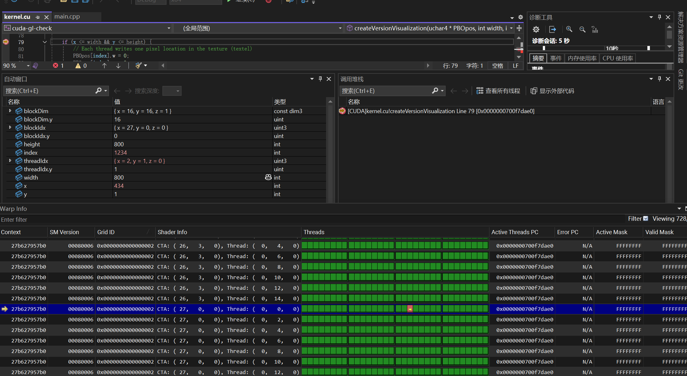

## Nsight Systems (Part 2.1.4)

Profiled the Debug x64 executable on the local RTX 2050 using Nsight Systems
2025.5.1. Updating from 2025.3.2 resolved the local agent connection timeout.
Reviewed Analysis Summary, Timeline, kernel events, and CUDA API statistics.
The target process (PID 5980) collected 3,963 CUDA events; the displayed
no-CUDA-event warnings referred to other processes.

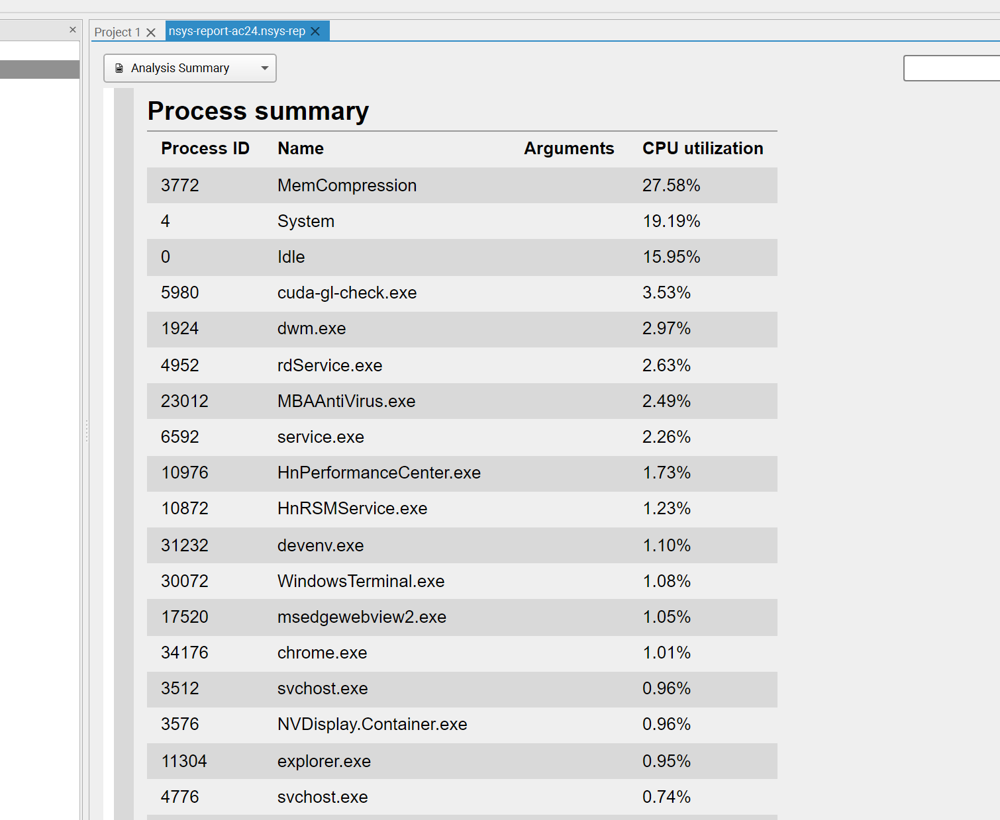

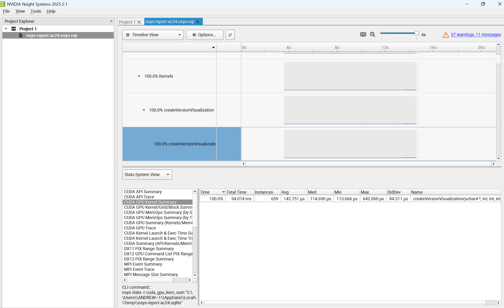

| Kernel: createVersionVisualization | Measurement |
| --- | --- |
| Instances | 659 |
| Total GPU duration | 94.074 ms |
| Average | 142.751 microseconds |
| Median | 114.690 microseconds |
| Minimum | 113.666 microseconds |
| Maximum | 642.060 microseconds |

These measurements are from the Debug build under profiling. The kernel's
100% time share refers to summed kernel duration, not GPU utilization.
Grid dimensions (50,50,1) and block dimensions (16,16,1) launch 640,000
threads for the 800 x 800 image.

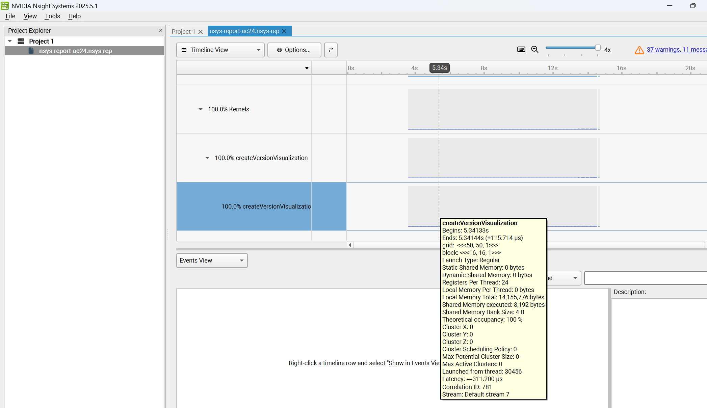

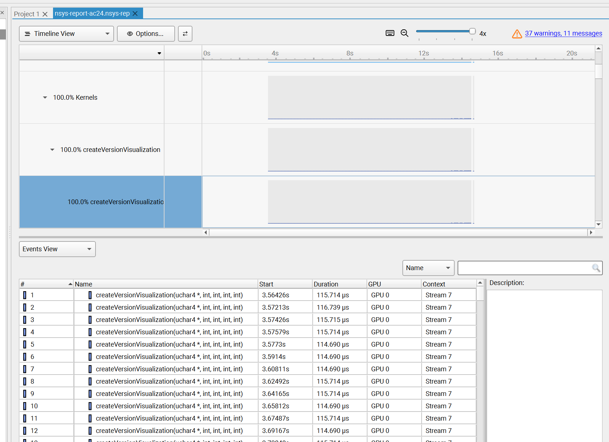

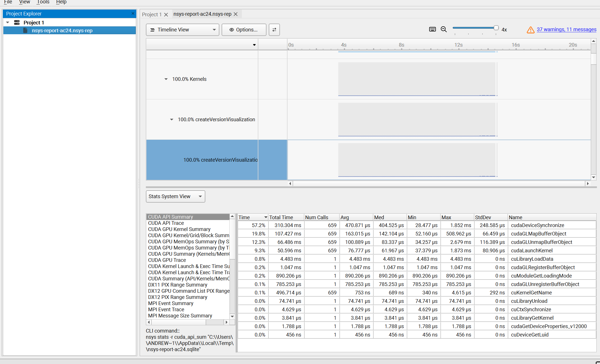

The four main APIs each ran 659 times: cudaDeviceSynchronize (310.304 ms
cumulative), cudaGLMapBufferObject (107.427 ms), cudaGLUnmapBufferObject
(66.486 ms), and cudaLaunchKernel (50.596 ms). Synchronization accounted
for 57.2% of recorded CUDA API time. API durations include waiting and may
overlap GPU execution; they must not be added to kernel time as an estimate
of total application runtime.

## Nsight Compute (Part 2.1.5)

Collected the basic metric set for one createVersionVisualization launch
using Nsight Compute 2025.3.0 and Application Replay (8 passes).
The Windows ANSI code page is now UTF-8 (65001); the CLI startup crash no
longer reproduced afterward. Kernel Replay still returned UnknownError,
while Application Replay successfully produced the report.

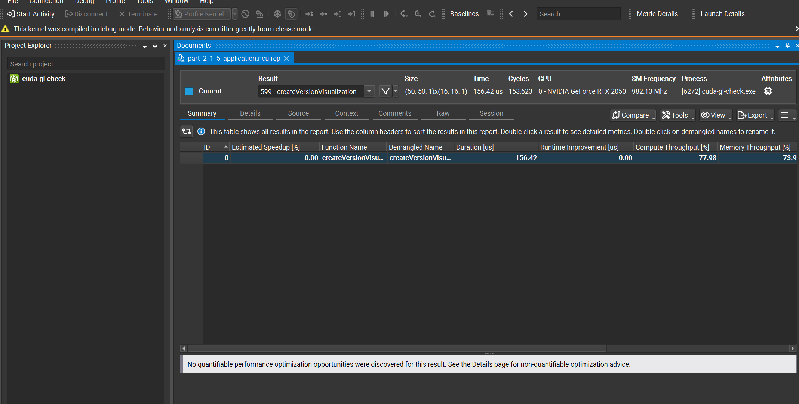

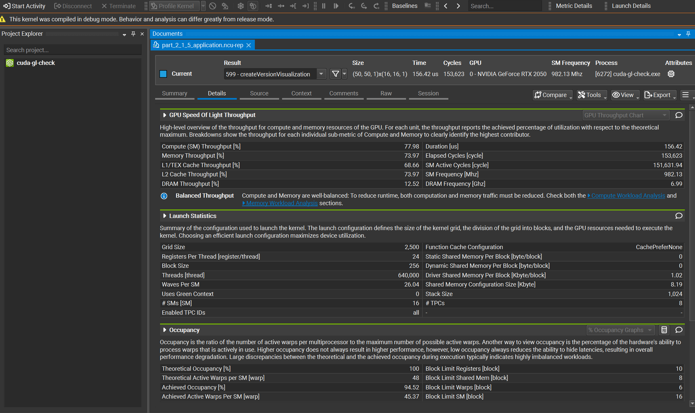

| Metric | Result |
| --- | --- |
| Kernel duration | 156.42 microseconds |
| Compute (SM) throughput | 77.98% |
| Memory throughput | 73.97% |
| DRAM throughput | 12.52% |
| Achieved occupancy | 94.52% |
| Theoretical occupancy | 100% |
| Grid / block size | 2,500 blocks / 256 threads per block |
| Registers per thread | 24 |

This is a Debug-build onboarding measurement, not a Release performance
benchmark. Throughput values are relative to the corresponding theoretical
peaks; memory throughput is not the same as DRAM throughput. The tool's
zero estimated speedup does not prove that no optimization is possible.

## WebGL (Part 2.2)

WebGL Report confirmed support for both WebGL 1 and WebGL 2 in the tested
browser (user agent: Chrome/152.0.0.0). Both reports identify Intel Iris Xe
Graphics through ANGLE with the Direct3D 11 backend. This browser graphics
adapter differs from the NVIDIA RTX 2050 used for the CUDA checks.
Both reports show antialiasing available and no major performance caveat.

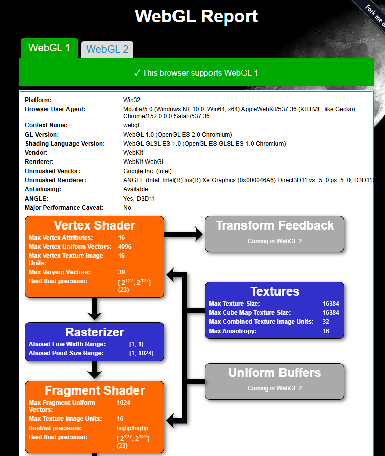

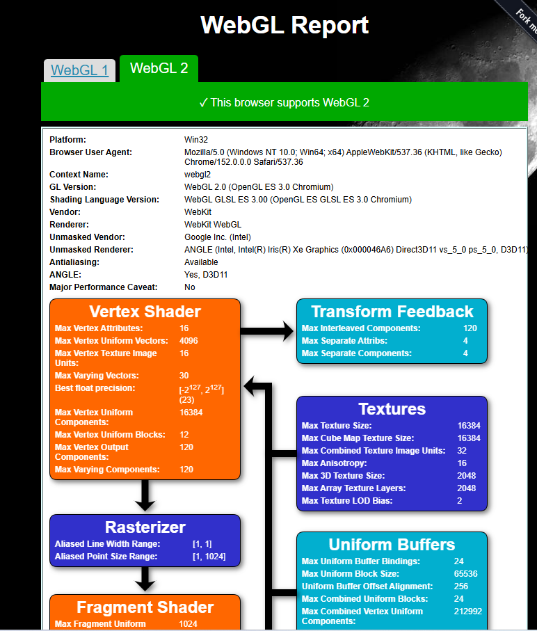

## WebGPU (Part 2.3)

The initial WebGPU Report
reports an Intel gen-12lp adapter with isFallbackAdapter=false. Both the
high-performance and compatibilityMode entries select this Intel adapter.
Worker tests report successful requestAdapter, requestDevice, and WebGPU
canvas context creation.

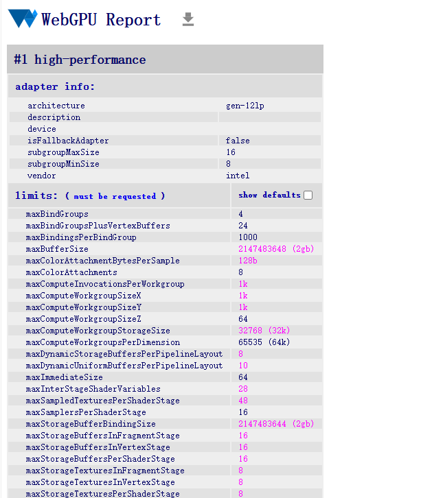

After switching the browser GPU preference and reopening the report, both
high-performance and compatibilityMode entries report vendor nvidia,
architecture ampere, and isFallbackAdapter=false. Subgroup minimum and
maximum sizes are both 32. The displayed dedicated/shared worker tests
successfully request an adapter, device, and WebGPU canvas context.
This verifies the multi-GPU switching check in Part 2.3.

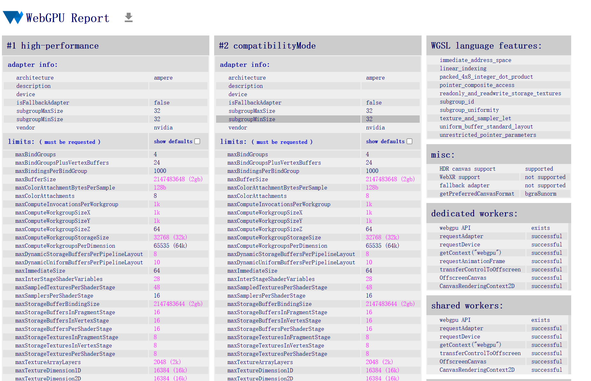
